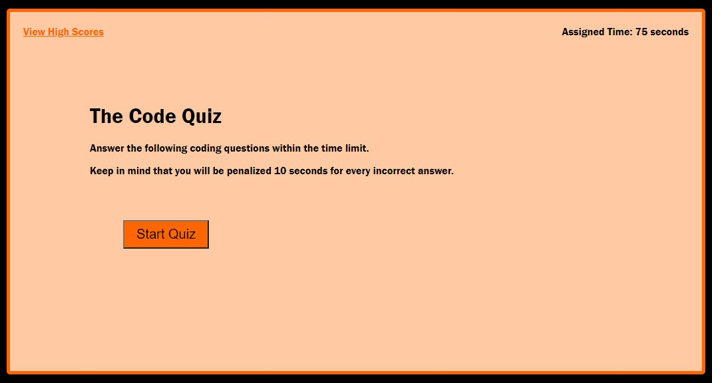

#The Code Quiz

## Objective

Build a timed coding quiz with multiple-choice questions that stores high scores. The app will run in the browser and feature dynamically updated HTML and CSS powered by JavaScript code. It will have a clean, polished and responsive user interface.

## Review

- Deployed application: [https://rogerscl116.github.io/the-code-quiz](https://rogerscl116.github.io/the-code-quiz)  
- GitHub repository: [https://github.com/rogerscl116/the-code-quiz](https://github.com/rogerscl116/the-code-quiz)

## Screen Shots

- ### Main Page

- ### High Scores Page

